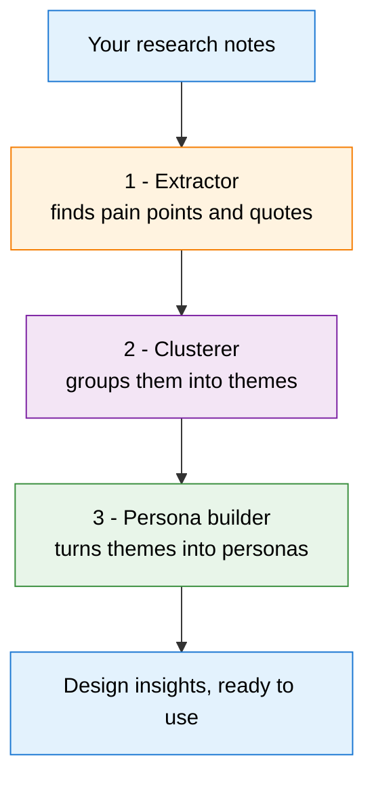
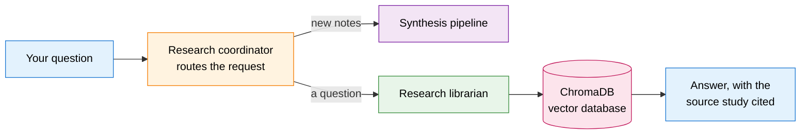

# Design Research Synthesis Agent


Turn messy user-research notes into structured design insight — **pain points, themes, and personas** — in one run, and search across all your past studies by meaning.

Built for the **Kaggle AI Agents: Intensive — Vibe Coding Capstone** (Track: Agents for Good / Freestyle).


---

## The problem

After user interviews, designers spend hours on synthesis: reading every transcript, pulling out pain points, grouping them into themes (affinity mapping), and writing personas. It's slow, manual, and the part of research everyone dreads. This agent does that first pass automatically, so the designer spends their time on judgement and ideas instead of sorting notes.

## Why agents?

Synthesis isn't one task — it's a sequence of distinct reasoning steps, each depending on the last. That maps cleanly onto a multi-agent pipeline: one agent extracts, the next clusters, the next builds personas. Each is a small specialist with a single job, and they hand work to each other through shared state. That's more reliable and easier to explain than one giant prompt trying to do everything at once.

---

## How it works

### Part 1 — The synthesis pipeline

Three agents run in order, each passing its result to the next through shared state:



### Part 2 — The research memory (RAG)

A searchable memory of all your past studies, so you can ask questions across everything you've ever researched:



Past studies are chunked, embedded with Gemini, and stored in ChromaDB. The librarian searches by **meaning, not keywords** — so "confusing instructions" also finds "I couldn't figure out what to do."

**Five reasoning agents in total:** three in the synthesis pipeline, plus the librarian and coordinator in the memory layer.

---

## Tech stack

| Tool | Role |
|------|------|
| **Google Agent Development Kit (ADK)** | Multi-agent orchestration |
| **Gemini 2.5 Flash** | Reasoning for every agent |
| **Gemini Embedding 001** | Turns text into searchable vectors |
| **ChromaDB** | Local vector database for semantic search |
| **Streamlit** | Web frontend |

Runs entirely on the **free** Gemini tier — no paid services.

---

## Setup

You need **Python 3.12** (ChromaDB has the widest support there) and a free Google Gemini API key.

**1. Get a free API key**
Go to https://aistudio.google.com/apikey and create a key. If key creation is blocked on a school/institutional account, use a personal Gmail account instead.

**2. Install dependencies**

Windows (PowerShell):
```powershell
python -m venv .venv
.venv\Scripts\Activate.ps1
pip install -r requirements.txt
```

Mac / Linux:
```bash
python3 -m venv .venv
source .venv/bin/activate
pip install -r requirements.txt
```

**3. Add your key**
Copy `.env.example` to a new file named `.env` and paste your key in (no quotes, no spaces):
```
GOOGLE_API_KEY=your_key_here
GOOGLE_GENAI_USE_VERTEXAI=FALSE
```
`.env` is git-ignored, so your key never gets committed. Never put your key directly in the code.

---

## Run it

**Step 1 — build the research memory (run once).**
Loads the studies in `past_studies/` into the vector database. Do this before using the RAG tab.
```
python ingest_memory.py
```

**Step 2 — launch the app.**

Windows (PowerShell):
```powershell
python -m streamlit run app.py
```

Mac / Linux:
```bash
streamlit run app.py
```

The app opens at `http://localhost:8501` with two tabs:

- **New Synthesis** — upload a `.txt` of interview notes or paste them in, and generate pain points, themes, and personas.
- **Research Memory (RAG)** — ask questions across your past studies and get answers that cite their source study.

### Other ways to run it

```bash
# Command-line synthesis (great for a demo)
python run_synthesis.py sample_interview_notes.txt

# Query past studies from the command line
python ask_memory.py "what have users said about confusing instructions?"
```

Swap in your own research by replacing `sample_interview_notes.txt`, or drop new `.txt` files into `past_studies/` and re-run `python ingest_memory.py`.

---

## Project structure

```
design-research-synthesis-agent/
├── synthesis_agent/
│   ├── __init__.py         # lets ADK discover the agent
│   └── agent.py            # the 3 synthesis agents + the SequentialAgent pipeline
├── research_memory/
│   ├── __init__.py
│   ├── agent.py            # librarian + coordinator agents
│   └── memory.py           # ChromaDB + Gemini embeddings (RAG)
├── app.py                  # Streamlit frontend
├── run_synthesis.py        # CLI synthesis runner + input security guard
├── ask_memory.py           # CLI research-memory query
├── ingest_memory.py        # loads past_studies/ into the vector DB (run once)
├── past_studies/           # sample past studies for the RAG memory
├── sample_interview_notes.txt
├── requirements.txt
├── .env.example            # template for your API key (copy to .env)
└── .gitignore
```

---

## Security

- No API keys or secrets are committed — the key lives only in the git-ignored `.env`.
- Input is size-capped and sanitised before reaching the model, and each agent is instructed to treat notes as data, not commands — a guard against prompt injection hidden in uploaded files.
- Runs entirely on the free Gemini tier; no external services beyond the model API.

---

## Troubleshooting

| Problem | Fix |
|---------|-----|
| `GOOGLE_API_KEY not set` | Make sure `.env` exists (not `.env.example`), the line starts with `GOOGLE_API_KEY=`, no quotes or spaces. |
| `models/text-embedding-004 is not found` | Google retired that model; this project uses `gemini-embedding-001`. |
| `streamlit is not recognized` (Windows) | Run it through Python: `python -m streamlit run app.py`. |
| ChromaDB install trouble | Use Python 3.12, which has the widest wheel support. |
